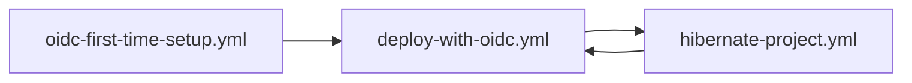

# 🚀 Deployment Guide

## 🔐 Security Model: OIDC Authentication

This project uses **GitHub OIDC** instead of storing AWS credentials:

- ✅ **Zero AWS credentials in GitHub**
- ✅ **Temporary credentials** (1-hour TTL)
- ✅ **Automatic credential rotation**
- ✅ **Complete audit trail** in CloudWatch
- ✅ **SOC2/ISO 27001 compliance ready**

## 🚀 Quick Start (First Time Setup)

Follow these steps to set up your full-stack project with secure OIDC authentication:

### Step 1: AWS Account Prerequisites

**1.1 Create S3 Bucket for Terraform State**
```bash
# Login to AWS Console as root user (with MFA)
# Navigate to S3 → Create bucket
# Configuration:
#   - Name: {your-prefix}-terraform-state-unique1029
#   - Region: us-east-1
#   - Versioning: ENABLED
#   - Encryption: ENABLED (AES-256)
#   - Block all public access: YES
```

> ⚠️ **Critical**: This bucket must be created MANUALLY before running any Terraform. Replace `{your-prefix}` with your project prefix (e.g., "agents").

**1.2 Create Temporary Setup User**
```bash
# Still in AWS Console as root:
# IAM → Users → Create user
# User name: temp-setup-{prefix}-{YYYYMMDD}
# Example: temp-setup-agents-20250826
# Attach policy: AdministratorAccess (AWS managed policy)
# After the user is created, in Security credentials tab→ Create access key → CLI
# ⚠️ Save these credentials in .initial_secrets file
```

### Step 2: Local Configuration

**2.1 Clone and Configure**
```bash
git clone https://github.com/your-org/nlw20Agents.git
cd nlw20Agents
```

**2.2 Create Secret Files**
```bash
# Copy templates
cp .initial_secrets.example .initial_secrets
cp .secrets.example .secrets
```

**2.3 Edit `.initial_secrets` (temporary - will be deleted)**
```bash
nano .initial_secrets
```
```env
# Add the temporary AWS credentials from Step 1.2:
TEMP_AWS_ACCESS_KEY_ID=AKIA...
TEMP_AWS_SECRET_ACCESS_KEY=...
```

**2.4 Edit `.secrets` (permanent project configuration)**
```bash
nano .secrets
```
```env
# GitHub Configuration
GITHUB_ORG=your-github-username
GITHUB_REPO=nlw20Agents
GH_PAT=your-github-personal-access-token

# AWS Configuration  
AWS_REGION=us-east-1
AWS_ACCOUNT_ID=123456789012

# Project Configuration
TF_VAR_PREFIX=agents

# Database Configuration
TF_VAR_DB_PASSWORD=your-secure-password-here
DB_NAME=agents
DB_USERNAME=postgres

# Application Configuration
OPENAI_API_KEY=your-open-api-key

```

**📝 Note on GitHub Personal Access Token (GH_PAT):**
The `GH_PAT` is required for AWS Amplify to access your GitHub repository and create webhooks for automatic deployments.

To create a GitHub Personal Access Token:
1. Your profile picture → Settings → Developer settings (down under) → Fine-grained tokens
2. Click "Generate new token"
3. Give it a name like "Amplify Deployment"
4. Only select repositories → Select your repo
5. Give it full write permission on the repo
6. Copy the generated token and use it as the `GH_PAT` value in your `.secrets` file

**2.5 Prepare GitHub Secrets**
```bash
# Validate and encode secrets
chmod +x prepare_secrets.sh
./prepare_secrets.sh
```

This creates two base64-encoded files:
- `.initial_secrets.b64` → GitHub Secret: `INITIAL_SECRETS_B64`
- `.secrets.b64` → GitHub Secret: `SECRETS_B64`

### Step 3: GitHub Repository Setup

**3.1 Push Code to GitHub**
```bash
git add .
git commit -m "feat: add OIDC workflows and initial configuration"
git push origin main
```

**3.2 Add Secrets to GitHub**
1. Go to your GitHub repository
2. Navigate to **Settings** → **Secrets and variables** → **Actions**
3. Create two repository secrets:

   **Secret 1: INITIAL_SECRETS_B64**
   - Name: `INITIAL_SECRETS_B64`
   - Value: Paste entire content of `.initial_secrets.b64`
   
   **Secret 2: SECRETS_B64**
   - Name: `SECRETS_B64`  
   - Value: Paste entire content of `.secrets.b64`

### Step 4: OIDC Setup (One-Time per AWS account; per-repo role auto-created)

**4.1 Run OIDC First-Time Setup**
1. Go to your GitHub repository
2. Navigate to **Actions** tab
3. Find **"OIDC First Time Setup"** workflow
4. Click **"Run workflow"** → **"Run workflow"**
5. Wait for completion (~5-10 minutes)

This workflow will:
- ✅ Create or detect existing GitHub OIDC Provider in your AWS account
- ✅ Create project-specific OIDC role with least-privilege policies
- ✅ Set up secure GitHub → AWS authentication
- ✅ Clean up temporary credentials automatically

### Step 5: Test Full Deployment (Before Cleanup!)

**🚀 CRITICAL: Test your deployment BEFORE deleting temporary credentials:**

1. **Run the "Deploy with OIDC" workflow** to verify OIDC works end-to-end
2. **Confirm all resources deploy successfully** (infrastructure, server, app runner)
3. **Only proceed to cleanup after successful deployment**

> **Why?** If OIDC has permission issues or other problems, you will need the temporary credentials to fix them. Don't delete your safety net until you know everything works!

### Step 6: Final Step - Security Cleanup (ONLY AFTER SUCCESSFUL DEPLOYMENT)

**⚠️ Keep temporary credentials until deployment succeeds:**

1. **Delete temporary AWS user:**
   ```bash
   # In AWS Console: IAM → Users → temp-setup-{prefix}-{date} → Delete
   ```

2. **Delete temporary GitHub secret:**
   ```bash
   # GitHub repo → Settings → Secrets → INITIAL_SECRETS_B64 → Delete
   ```

3. **Clean up local files:**
   ```bash
   rm .initial_secrets
   rm .initial_secrets.b64 .secrets.b64
   ```

4. **Keep only SECRETS_B64** in GitHub for all future deployments

## 🏗️ Project Isolation Strategy

This setup is designed for **per-project isolation** with shared OIDC infrastructure:

### 🔐 Per-Project Resources (Created Every Time):
- ✅ **Separate S3 bucket per project** (`{prefix}-terraform-state-unique1029`)
- ✅ **Separate GitHub Deploy Role** (`{prefix}-github-deploy-role`)
- ✅ **Separate temporary AWS credentials** (deleted after setup)
- ✅ **Independent Terraform state** per project

### 🌐 Shared AWS Account Resources (One-Time):
- ✅ **GitHub OIDC Provider** (created once, automatically detected and reused)

### 🔍 Smart OIDC Detection:
- **First Project**: Creates OIDC provider + project role
- **Subsequent Projects**: Detects existing OIDC provider, skips creation, creates only project role
- **Clear Logging**: Shows exactly what's being created vs reused

**_OIDC Provider_**: GitHub OIDC trust relationship with AWS, one per aws account. 
Can be reused across projects.

**_OIDC Role_**: IAM role that allows GitHub to assume it. One per project (uses prefixed project name).

### 🚀 Using This as a Template:

**For Each New Project:**
1. **Clone/Fork this repository**
2. **Create project-specific AWS resources:**
   - Create S3 bucket: `{new-prefix}-terraform-state-unique1029`
   - Create temporary AWS user: `temp-setup-{new-prefix}-{YYYYMMDD}`
3. **Update configuration files:**
   - Update `.initial_secrets` with new temporary AWS user credentials
   - Update `.secrets` file with new prefix (e.g., `TF_VAR_PREFIX=myapp`)
4. **Prepare and add GitHub secrets:**
   - Run `./prepare_secrets.sh` to encode files
   - Add `INITIAL_SECRETS_B64` and `SECRETS_B64` to GitHub repository secrets
5. **Run OIDC setup workflow** - it will detect existing OIDC and create only project resources

## 💰 Costs and Budget

For comprehensive cost analysis, service-by-service breakdowns, optimization strategies, and hibernation savings calculator, see **[COSTS.md](COSTS.md)**.

**Quick Summary:** $109-340/month active deployment, **$0/month** during hibernation.

## 🏗️ Deployment Workflows

### 📋 Available Workflows

| Workflow | Purpose | Trigger | Duration |
|----------|---------|---------|----------|
| `oidc-first-time-setup.yml` | One-time OIDC setup | Manual | ~5-10 min |
| `deploy-with-oidc.yml` | Full infrastructure deployment | Manual | ~15-25 min |
| `hibernate-project.yml` | Zero-cost hibernation | Manual | ~10-15 min |

### 🔐 OIDC First-Time Setup
**Purpose:** Establish secure GitHub OIDC authentication for AWS deployments

**What it creates:**
- GitHub OIDC provider (shared across projects)
- Project-specific IAM role with minimal permissions
- S3 bucket for Terraform state storage

**When to run:** Once per AWS account, before any deployments

### 🚀 Main Deployment (Deploy with OIDC)
**Purpose:** Deploy complete application infrastructure to AWS

**What it deploys:**
- **Backend:** .NET API on AWS App Runner
- **Frontend:** Next.js app on AWS Amplify
- **Database:** Aurora PostgreSQL with pgvector
- **Network:** VPC with public/private subnets
- **Registry:** ECR for Docker images

**Cost Analysis:** See **[COSTS.md](COSTS.md)** for detailed cost breakdown by service

**Workflow Options:**
- ✅ Deploy Infrastructure
- ✅ Deploy Server
- ✅ Deploy App Runner
- ✅ Deploy Amplify
- ✅ Configure App Runner CORS with Amplify URL

### 🛌 Project Hibernation
**Purpose:** Achieve zero-cost hibernation while preserving shared resources

**What it destroys:** See **[COSTS.md](COSTS.md)** for cost impact details

**What it preserves:**
- 🔐 Shared OIDC provider (for other projects)
- 📁 All code and configurations
- 🔧 GitHub repository and workflows
- 📋 Infrastructure blueprints (Terraform modules)

**Reactivation process:**
1. Recreate S3 terraform state bucket
2. Run `oidc-first-time-setup.yml` (reuses existing provider)
3. Run `deploy-with-oidc.yml` to recreate all resources

**Savings Calculator:** See **[COSTS.md](COSTS.md)** for hibernation savings analysis

### 💡 Workflow Strategy

**Development → Production → Hibernation:**


**Key Benefits:**
- **Zero AWS Credentials:** GitHub OIDC handles authentication
- **Complete Infrastructure as Code:** Terraform manages everything
- **True Zero Cost:** Full hibernation preserves shared resources (see **[COSTS.md](COSTS.md)**)
- **Quick Reactivation:** Automated redeployment from preserved blueprints

> 🎯 **All workflows are manual-only** - No automatic deployments occur. You have full control over when and what gets deployed.

## 🗑️ Infrastructure Teardown

### Hibernation Workflow

For detailed hibernation instructions, see the **"🛌 Project Hibernation"** section above.

**Quick Hibernation Steps:**
1. **GitHub Actions** → **"Hibernate Project"**
2. Type `HIBERNATE` to confirm
3. Wait for completion (~10-15 minutes)

**Result:** Zero-cost hibernation while preserving shared OIDC provider for other projects.

### Manual S3 Cleanup (If Needed)

If automated S3 state bucket cleanup fails during hibernation, manually delete it:

```bash
# Replace YOUR_PREFIX with your actual prefix from .secrets file
BUCKET_NAME="YOUR_PREFIX-terraform-state-unique1029"

# Delete all object versions and delete markers
aws s3api list-object-versions --bucket "$BUCKET_NAME" \
  --query 'Versions[].[Key,VersionId]' --output text | \
  while read key version; do
    aws s3api delete-object --bucket "$BUCKET_NAME" \
      --key "$key" --version-id "$version"
  done

aws s3api list-object-versions --bucket "$BUCKET_NAME" \
  --query 'DeleteMarkers[].[Key,VersionId]' --output text | \
  while read key version; do
    aws s3api delete-object --bucket "$BUCKET_NAME" \
      --key "$key" --version-id "$version"
  done

# Delete the empty bucket
aws s3api delete-bucket --bucket "$BUCKET_NAME"
```

## 📊 Infrastructure Overview

### AWS Services Deployed

| Service                  | Configuration                  | Purpose                        |
|--------------------------|--------------------------------|--------------------------------|
| **GitHub OIDC Provider** | Trust relationship with GitHub | Secure authentication          |
| **Aurora Serverless v2** | 0.5-1 ACU, PostgreSQL          | Application database           |
| **App Runner**           | 1 vCPU, 2 GB RAM               | .NET API hosting               |
| **AWS Amplify**          | Next.js hosting + CI/CD        | Frontend hosting               |
| **ECR**                  | Private repository             | Docker image storage           |
| **VPC**                  | 2 public + 2 private subnets   | Network isolation              |

For detailed cost analysis and optimization strategies, see **[COSTS.md](COSTS.md)**.

## 🛠️ Troubleshooting

### Common Issues

**1. OIDC Setup Fails**
```bash
# Check if S3 bucket exists and is accessible
# Verify temporary AWS credentials have AdministratorAccess
# Ensure AWS account ID is correct in .secrets
```

**2. Deployment Fails - "Role cannot be assumed"**
```bash
# OIDC role doesn't exist or trust relationship is wrong
# Re-run "OIDC First Time Setup" workflow
# Check GitHub repository settings match .secrets configuration
```

**3. Database Connection Issues**
```bash
# Verify Aurora is in "available" state in AWS Console
# Check security group allows App Runner connections
# Confirm database password matches what's in .secrets
```

**4. App Runner Service Won't Start**
```bash
# Check CloudWatch logs: AWS Console → App Runner → Service → Logs
# Verify ECR image was pushed successfully
# Confirm appsettings.Production.json is valid JSON
```

**5. ECR Push Permission Denied**
```bash
# OIDC role might not have ECR permissions
# Check IAM policies in infra/1-oidc/modules/iam-policies/
```

**6. Amplify Deployment Fails (Next.js 15 SSR Complex Setup)**
```bash
# Check Amplify build logs in AWS Console
# Common Next.js 15 SSR issues with Amplify:

# Issue 1: Missing deploy-manifest.json
# Solution: Ensure web/scripts/prepare-amplify-deployment.js runs
# This creates .amplify-hosting/deploy-manifest.json with:
# - computeResources pointing to nodejs20.x runtime
# - entrypoint set to server.js
# - routes configured for SSR

# Issue 2: Standalone build not found
# Solution: Verify next.config.js has:
# output: "standalone"

# Issue 3: Static files not in correct location
# Solution: The script copies .next/static to the standalone build

# Issue 4: Server.js missing or in wrong location
# Solution: Script ensures server.js is at compute/default root

# Key Files Created by prepare-amplify-deployment.js:
# .amplify-hosting/
#   ├── deploy-manifest.json (SSR configuration)
#   └── compute/default/
#       ├── server.js (Next.js standalone server)
#       ├── .next/static/ (static assets)
#       └── public/ (public files)
```

**Amplify SSR Deployment Process:**
1. `npm run build:amplify` (not regular build)
2. Creates standalone Next.js server
3. Generates deploy-manifest.json with compute resources
4. Copies files to .amplify-hosting structure
5. Amplify deploys using nodejs20.x runtime for SSR

The web/scripts/prepare-amplify-deployment.js handles the complexity to deploy Next.js 15 SSR correctly:
- Create deploy-manifest.json with the correct SSR configuration
- Copies standalone build to .amplify-hosting/compute/default/
- Ensures static files and public directory are in the right place
- Moves server.js to the correct location

5. Different Build Command

- Must use npm run build:amplify (not regular npm run build)
- This runs both next build AND the preparation script


### Debug Commands

**Check OIDC Role**
```bash
# In GitHub Actions workflow:
aws sts get-caller-identity
aws iam get-role --role-name agents-github-deploy-role
```

**Verify Infrastructure**
```bash
# Local Terraform inspection:
cd infra/2-resources
terraform init
terraform show
```

**App Runner Logs**
```bash
# View real-time logs:
aws logs tail /aws/apprunner/agents-app-runner-service --follow
```

## 🔄 Maintenance

### Regular Tasks

- **Quarterly**: Review and rotate any remaining AWS credentials
- **Monthly**: Check AWS costs and optimize resources
- **Weekly**: Review CloudWatch logs for errors
- **As needed**: Update Terraform providers and GitHub Actions

### Backup Strategy

- **Terraform State**: Automatically versioned in S3
- **Database**: Aurora automatic backups (7-day retention)
- **Code**: Git repository with branch protection
- **Secrets**: Keep local backup of `.secrets` file securely

### Updates and Upgrades

**Update Dependencies**
```bash
# .NET packages
cd server && dotnet list package --outdated

# Node.js packages  
cd web && npm audit

# Terraform providers
cd infra && terraform init -upgrade
```

**Infrastructure Updates**
```bash
# Apply infrastructure changes:
# 1. Make changes to Terraform files
# 2. Push to main branch  
# 3. Deploy-on-change workflow triggers automatically
# OR manually trigger "Deploy with OIDC" workflow
```

## 📚 Additional Resources

### Documentation Links

- [GitHub OIDC with AWS](https://docs.github.com/en/actions/deployment/security-hardening-your-deployments/configuring-openid-connect-in-amazon-web-services)
- [AWS App Runner](https://docs.aws.amazon.com/apprunner/)
- [Aurora Serverless v2](https://docs.aws.amazon.com/AmazonRDS/latest/AuroraUserGuide/aurora-serverless-v2.html)
- [Terraform AWS Provider](https://registry.terraform.io/providers/hashicorp/aws/latest/docs)

### Project Structure Details

```
infra/
├── 1-oidc/              # GitHub OIDC trust setup
│   ├── main.tf          # OIDC provider and IAM role
│   ├── variables.tf     # Input variables
│   ├── outputs.tf       # GitHub role ARN
│   └── modules/
│       └── iam-policies/  # Least-privilege policies
├── 2-resources/         # Core infrastructure
│   ├── main.tf          # VPC, Aurora, ECR
│   └── modules/
│       ├── aurora/      # Database configuration
│       ├── vpc/         # Network setup
│       └── ecr/         # Container registry
├── 3-apprunner/         # .NET API hosting
│   ├── main.tf          # App Runner service
│   └── modules/
│       └── app_runner/  # App Runner module
└── 4-amplify/           # Next.js SSR hosting
    ├── main.tf          # Amplify app configuration
    └── modules/
        └── amplify/     # Amplify hosting module
```

## 🆘 Support

For issues or questions:

1. **Check workflow logs** in GitHub Actions
2. **Review AWS CloudWatch** logs for runtime issues  
3. **Verify Terraform state** consistency
4. **Ensure all secrets** are properly configured
5. **Confirm S3 state bucket** exists and is accessible

**Need help?** Open an issue in this repository with:
- Steps to reproduce the problem
- Relevant log output (redact sensitive information)
- Your environment details (AWS region, project prefix, etc.)