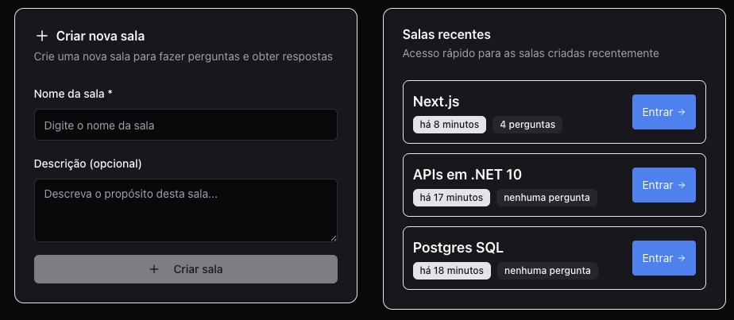
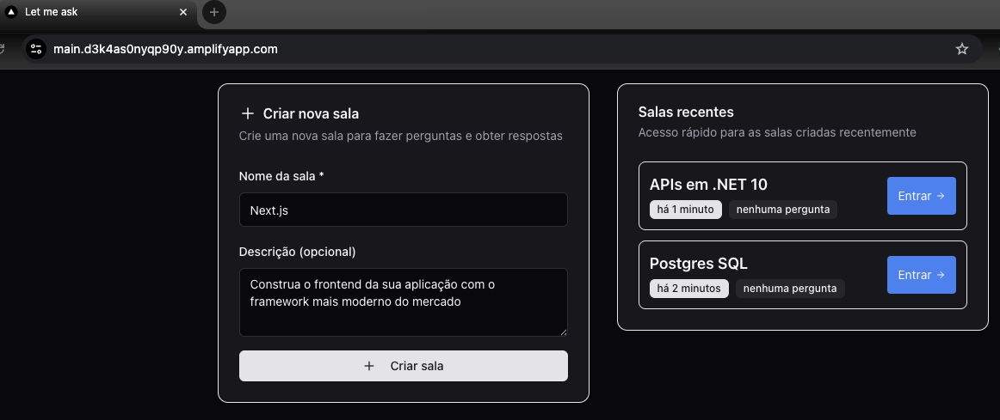
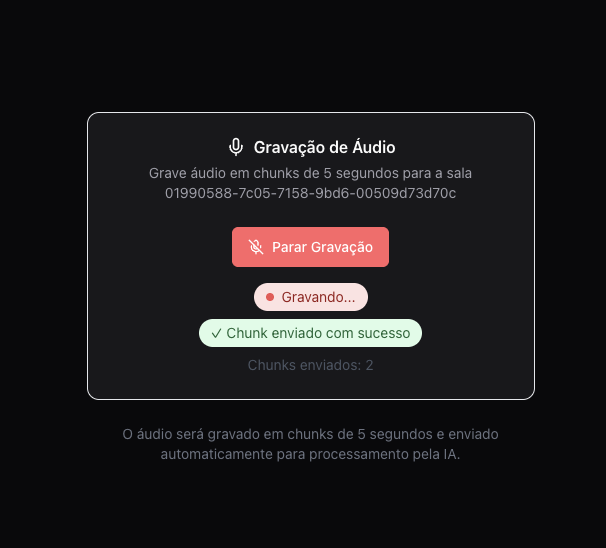
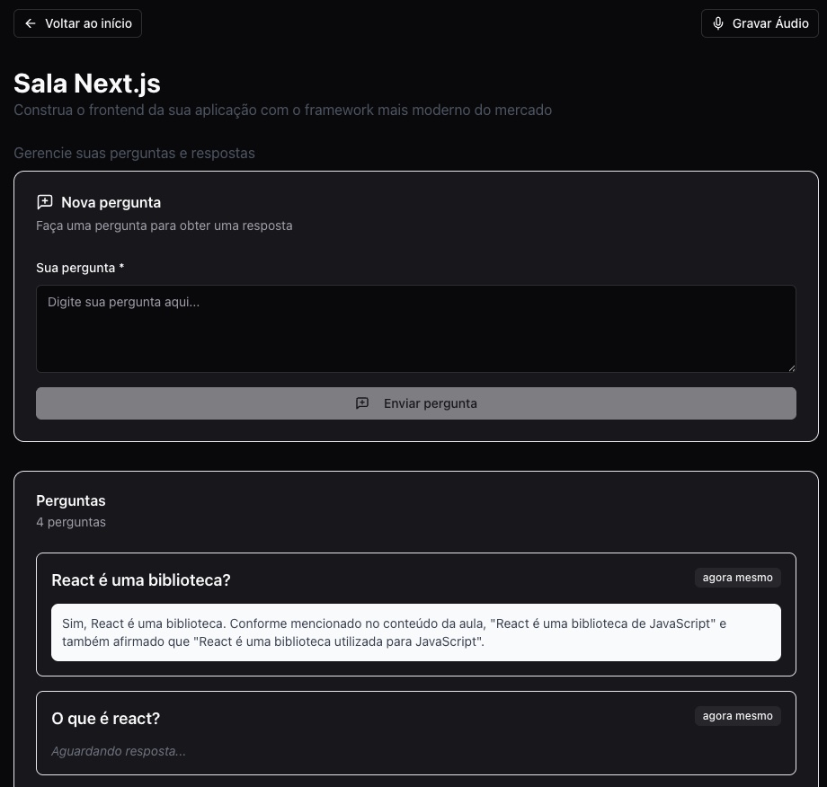

<div align="center">

# Let me ask



*Made in NLW 20 bootcamp promoted by Rocketseat*

[](https://dotnet.microsoft.com/)
[](https://nextjs.org/)
[](https://www.typescriptlang.org/)
[](https://aws.amazon.com/)
[](https://www.postgresql.org/)
[](https://openai.com/)
[](https://www.terraform.io/)
[](https://www.docker.com/)

</div>

## 🎯 About the App

**Let me ask** is an AI-powered educational platform that allows you to create virtual rooms for recording lessons and get intelligent answers from your recorded content. Upload your lessons, ask questions, and let AI find the answers directly from your recordings.

### 📸 App Screenshots

| Create Room | Record Lesson | Ask Questions |
|-------------|---------------|---------------|
|  |  |  |

### 🚀 Tech Stack Highlights

**🖥️ Server**
- Domain Driven Design (DDD) architecture
- .NET 9 with latest C# features
- AI Integration (OpenAI GPT)
- Clean Architecture patterns
- Entity Framework Core
- PostgreSQL database with pgvector extension

**☁️ Infrastructure**
- Complete AWS infrastructure as code
- Terraform for infrastructure management
- GitHub OIDC for secure deployments
- AWS App Runner for containerized hosting
- Aurora Serverless v2 PostgreSQL
- ECR for Docker image registry
- VPC with public/private subnets

**🌐 Web Frontend**
- Next.js 15 with React Server Components
- TanStack Router for type-safe routing
- TanStack Query for data fetching
- Orval for API client generation
- TypeScript for type safety
- Tailwind CSS for styling
- Modern React patterns and hooks

## 📋 Architecture & Project Structure

```
nlw20Agents/
├── .github/
│   └── workflows/
│       ├── oidc-first-time-setup.yml     # 🔐 OIDC authentication setup
│       ├── deploy-with-oidc.yml          # 🚀 Infrastructure deployment
│       └── hibernate-project.yml         # 🛌 Cost hibernation
├── infra/
│   ├── 1-oidc/                         # GitHub OIDC setup
│   ├── 2-resources/                    # VPC, Aurora, ECR
│   ├── 3-apprunner/                    # App Runner service (.NET API hosting)
│   └── 4-amplify/                      # AWS Amplify (Next.js SSR hosting)
├── server/                            # .NET 9 Backend API
├── web/                               # Next.js Frontend
├── .initial_secrets.example           # Temporary AWS credentials
├── .secrets.example                   # Project configuration
└── prepare_secrets.sh                 # Secrets validation script
```

## 🚀 Deployment & Workflows

For complete deployment instructions with AWS OIDC setup, see **[DEPLOYMENT.md](DEPLOYMENT.md)**

### 📋 Available Workflows

| Workflow | Purpose | Cost Impact |
|----------|---------|-------------|
| `oidc-first-time-setup.yml` | 🔐 One-time OIDC setup | None |
| `deploy-with-oidc.yml` | 🚀 Full infrastructure deployment | ~$50-150/month |
| `hibernate-project.yml` | 🛌 Zero-cost hibernation | **$0/month** |

**Quick Start:**
1. **Setup OIDC:** Run `oidc-first-time-setup.yml` once per AWS account
2. **Deploy:** Run `deploy-with-oidc.yml` to deploy all infrastructure
3. **Hibernate:** Run `hibernate-project.yml` to achieve zero-cost hibernation
4. **Reactivate:** Run `deploy-with-oidc.yml` to restore from hibernation

> 📖 **Detailed workflow documentation** including step-by-step instructions, cost breakdowns, and troubleshooting is available in **[DEPLOYMENT.md](DEPLOYMENT.md)**

## 🔧 Development Workflow

### Local Development Setup

**Backend (.NET 9)**
```bash
cd server
dotnet restore
dotnet run --project server.API
# API available at: http://localhost:5000
```

**Frontend (Next.js)**
```bash
cd web
npm install
npm run dev
# Web app available at: http://localhost:3000
```

**Database (PostgreSQL with pgvector)**
```bash
# Use Docker Compose for local database with pgvector extension
cd server
docker-compose up -d

# Alternative: Manual Docker setup
docker run --name postgres-local -e POSTGRES_PASSWORD=postgres -p 5432:5432 -d pgvector/pgvector:pg17

# Option 3: Connect to deployed Aurora (use connection string from AWS Console)
```

> **Note:** The project uses PostgreSQL with the pgvector extension for vector similarity search. See `server/docker-compose.yaml` for the complete local database setup.

### 🧭 Vector Search (pgvector)

This project stores OpenAI embeddings for each audio chunk and performs similarity search directly in Postgres using the pgvector extension.

- Storage: an `Embeddings` column of type `vector` on the `AudioChunks` table
- Query: order by pgvector's distance operator `<=>` (cosine distance) to get nearest neighbors
- Threshold: after fetching the nearest items, we apply an additional cosine-distance threshold in C# to keep only highly relevant results

See the actual implementation in: `server/server.Infrastructure/Repositories/AudioRepository.cs`.

Minimal query flow from the repository:

```csharp
using Pgvector;
...
var questionVector = new Vector(questionEmbeddings);
var similarChunks = await dbContext.AudioChunks
    .FromSqlRaw(@"
        SELECT * FROM \"AudioChunks\"
        WHERE \"RoomId\" = {0} AND \"Active\" = true
        ORDER BY \"Embeddings\" <=> {1}
        LIMIT {2}", roomId, questionVector, limit)
    .ToListAsync();

// Optional post-filter (cosine distance):
// <=> returns cosine distance; we keep entries with distance <= (1 - similarityThreshold)
```

Notes:
- The `<=>` operator returns cosine distance (0 = identical, larger = less similar). We convert a similarity threshold (e.g., 0.7) into a max distance of `1 - 0.7 = 0.3` for filtering.
- Local dev uses the `pgvector/pgvector:pg17` image which has the extension preinstalled.
- For Aurora PostgreSQL, ensure the pgvector extension is supported/enabled for your engine version.

### 🏗️ Monorepo Structure

This project started as separate repositories for the frontend, backend, and infrastructure components. We consolidated them into a single monorepo to improve development workflow, deployment coordination, and code sharing.

**Migration Process:**
- Originally maintained as 3 separate repositories
- Consolidated using safe monorepo setup procedures (see [safe_monorepo_setup.md](safe_monorepo_setup.md))
- Preserved complete Git history from all original repositories
- Maintains clear separation of concerns with dedicated directories

**Benefits of Monorepo Approach:**
- ✅ **Unified Deployment**: Single workflow deploys all components
- ✅ **Shared Configuration**: Common secrets and environment variables
- ✅ **Atomic Changes**: Frontend and backend changes deployed together
- ✅ **Simplified CI/CD**: One repository, one set of GitHub Actions
- ✅ **Better Code Sharing**: Easier to share types and utilities

**Directory Independence:**
Each directory (`server/`, `web/`, `infra/`) maintains its own:
- Package management (`package.json`, `*.csproj`, `*.tf`)
- Build processes and dependencies
- Development workflows
- Testing strategies

This structure combines the benefits of monorepo coordination with the flexibility of independent component development.

### Environment Variables

**Development (.NET)**

server/server.API/appsettings.Development.json
```json
{
  "ConnectionStrings": {
    "DefaultConnection": "Host=localhost;Database=agents_dev;Username=postgres;Password=postgres"
  },
  "OpenAI": {
    "ApiKey": "sk-your-dev-key"
  }
}
```

**Production (Generated by CI/CD)**
The workflows automatically generate `appsettings.Production.json` with:
- Aurora endpoint from Terraform outputs
- Database credentials from secrets
- AWS configuration for OIDC authentication

## 🤝 Contributing

1. Fork the repository
2. Create feature branch: `git checkout -b feature/my-feature`
3. Make changes and test locally
4. Ensure all workflows pass in your fork
5. Create pull request

## 📄 License

This project is licensed under the MIT License - see the LICENSE file for details.